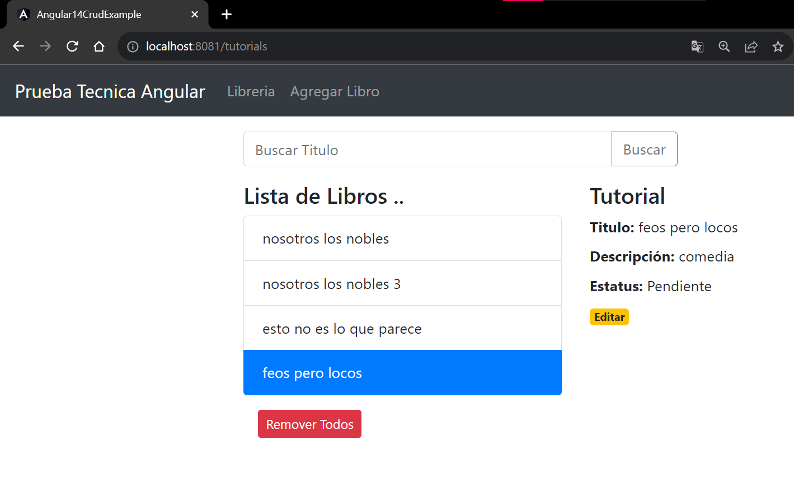

# Practicando con Spring Angular 
# Spring Boot + Angular 14 + ejemplo CRUD de PostgreSQL

Aplicación de tutorial CRUD de pila completa Angular 14 + Spring Boot + PostgreSQL en eso:
- Cada Tutorial tiene identificación, título, descripción y estado de publicación.
- Podemos crear, recuperar, actualizar, eliminar Tutoriales.
- También podemos encontrar Tutoriales por título.



## Ejecute la aplicación Spring Boot
```
mvn spring-boot:run
```
Spring Boot Server exportará la API en el puerto `8081`.

## Ejecutar cliente angular
```
npm install
ng serve --port 8081
```